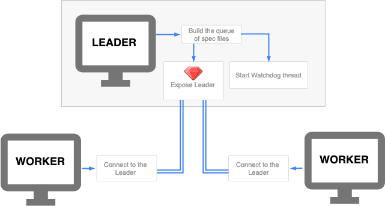
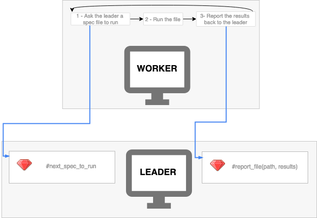

# cucumber-distrib

A command-line tool to build a queue of tests and run them in parallel on
multiple machines/processes with [Cucumber](https://cucumber.io/).

## Rationale

A really large features suite takes significantly less to execute when
spread across multiple processes.

Naive approach is to split tests into batches, and run a process passing it
a batch of tests, but due to uneven distribution spikes in total wall clock time
happen. Distrib's queue feature allows to dynamically
serve test files one by one over the network, rather than pre-splitting them
into batches.

In the cloud the machines are either ephemeral, e.g. short-lived and can be
preempted at any moment of time, or significantly more expensive, making it
either impossible or expensive to run tests on a single machine. The goal is to
reduce total build time to minutes, and even running on a beefiest machine
doesn't help much to achieve that.

## Overview

cucumber-distrib is a relatively simple client-server (Leader-Worker) wrapper on
top of Cucumber, which dynamically serves tests to clients (workers) that
load and execute them one by one, and aggregates the results in the same format
a regular `Cucumber` would do.

It is possible to run cucumber-distrib on a local machine, or run the Leader
locally, and Workers remotely, or run both Leader and Workers on CI, depending
on your needs. There are no tangible limitations on the number of Workers.
Workers can run side-by-side using [parallel_tests], sharing the external
services like database, Redis, Memcached, ElasticSearch, that your integration
tests might need.

The queue is fault-tolerant, e.g. when a worker machine goes down or experiences
a network partition, the test being executed is returned back to the queue
on timeout, and later passed to another worker.

## Installation

Add to the Gemfile:

```ruby
git 'git@github.com:toptal/test-distrib.git', branch: 'main' do
  gem 'cucumber-distrib', require: false, group: [:test]
  gem 'distrib-core', require: false, group: [:test]
end
```

## Running

There is not much difference between running on local machine, or across the
network.

```shell
$ bundle exec cucumber-distrib start     | $ bundle exec cucumber-distrib join 127.0.0.1
100 tests have been enqueued             | .................*......F..._
Using the default profile
```

## Leader

The Leader purpose is to serve tests names one by one to workers, and
aggregate the results of running those tests with Cucumber.

The following command:
- builds a queue of tests
- starts a watchdog thread (see more about watchdog in the 3rd stage)
- exposes a Leader [DRb] server on all the network interfaces

```shell
bundle exec cucumber-distrib start
```

You can specify profiles, which will be used to organize reporters on Leader and workers.
Or it will be set automatically based on `cucumber.yml`.

```
bundle exec cucumber-distrib start ci
```



Once there are no more tests left, the Leader drops all connections, and
reports.


## Worker

Worker connects to the Leader, receives test names from it, and report back
the results.

The following command runs a worker:

```shell
bundle exec cucumber-distrib join leader_address
```

where `leader_address` is either an IP address, or a domain name.

Worker requests test from the Leader, `next_test_to_run` and reports
the execution results `report_file` back to the leader.



## Development

To start up development of the gem first make sure you could run the following commands without problems:

```shell
bundle install
bundle exec rspec spec
bundle exec rspec features
bundle exec rubocop
bundle exec yardoc --fail-on-warning
```

Tests under `spec` are unit tests, while `features` are integration tests.

Features could be used for manual tests while developing.
To proceed such manual test open following directory in **two separate console tabs**/windows:

```shell
cd features/fixtures/cucumber/
```

### Leader

Pick features set (directory name) from [features/fixtures/cucumber/features](features/fixtures/cucumber/features).
Assuming we want to run `passing` features set:

```shell
export CUCUMBER_DISTRIB_FOLDER=passing
```

Tune settings to have more time for manual tests:

```shell
export CUCUMBER_DISTRIB_FEATURES_TEST_TIMEOUT=40
export CUCUMBER_DISTRIB_FEATURES_FIRST_TEST_PICKED_TIMEOUT=50
```

Start leader:

```shell
bundle exec cucumber-distrib start
```

### Worker

Start worker:

```shell
bundle exec cucumber-distrib join 127.0.0.1
```

## Formatters

Take a look at [cucumber.yml](features/fixtures/cucumber/cucumber.yml) and [features_formatter.rb](features/fixtures/cucumber/support/features_formatter.rb) - it's a good starting point to play with formatters.

## Reports

Workers are sending the reports to the Leader immediately after running
scenarios and steps from that test. This means that if a worker dies, the Leader has kept
all the previous reports.

## Configuration

`cucumber-distrib` expects to find configuration in `.cucumber-distrib` file
which is loaded if it exists. Configuration is expected to be a Ruby file.

:information_source: See [cucumber/distrib/configuration.rb](lib/cucumber/distrib/configuration.rb) for the full list of options.

### Test files to execute

Override default list of the test files:

```ruby
Cucumber::Distrib.configure do |config|
  config.tests_provider = -> {
    Dir.glob(['features/**/*.feature', 'engines/**/*.feature'])
  }
end
```

### Test retries

`cucumber-distrib` can re-run tests by certain exceptions:

```ruby
Cucumber::Distrib.configure do |config|
  config.retryable_exceptions = ['Elasticsearch::Transport::Transport::Errors::ServiceUnavailable']
  config.retries_count = 2
end
```

It means that any test which failed because of `Elasticsearch::Transport::Transport::Errors::ServiceUnavailable`
will be retried up to two times.

### Timeouts

Set equal timeout for all test files to 30 seconds:

```ruby
Cucumber::Distrib.configure do |config|
  config.test_timeout = 30 # seconds
end
```

To specify timeout per feature file use and object that responds to `call` and receives
the file path as an argument. The proc returns the timeout in seconds.
This is also useful for cases where some features have a timeout strategy and some
don't.

```ruby
Cucumber::Distrib.configure do |config|
  config.test_timeout = ->(feature) do
    10 + 2 * average_execution_in_seconds(feature)
  end
end
```

## FAQ

> Is it simple to use it in my project?

Yes, it's simple if you are using Cucumber already. cucumber-distrib is almost a
drop-in replacement. If you plan to run several Workers side-by-side on a single
machine, check [parallel_tests] documentation how to set your project up.

> How is timeout defined?

Timeout is configurable in a configuration file. By default it's set to be 60
seconds. It can be configured for all of the test files, or, if you have a
storage where you keep previous execution times per test file, we encourage
you to use this average of a couple of last builds to calculate the timeout.
Using double the average execution time plus ten seconds is a good strategy
that prevents test files from returning to the queue while still being executed.
It mitigates two cases:

1) test execution time doubled

2) test was fast (milliseconds), and then a test file or its dependencies change
and it execution time changes, and it takes seconds.

> What happens if there's a really slow test?

Test file is picked up by Worker #1, times out, is returned to the queue, and is
picked up by the next worker, Worker #2. The first to submit the results wins.

> What if there's nothing left in the queue, but some test files are being
processed?

The idle workers wait in the queue just in case there's a timed out test file.

> Is it secure?

[DRb], the transport used, is not secure. Executing of arbitrary code on the
Leader machine is possible. Make sure no one outside of the test environment can
communicate with it.

> Who can access the Leader machine?

Anyone who has access to it over the network. Make sure it's not exposed to the
Internet.

> What is the default port?

It's port 8788, default for [DRb].

> Is it thread-safe?

Yes, thread-safe data structures are used in the implementation, and access to
non-thread-safe data structures is synchronized.

> Are the workers using the same seed the execute the tests?

Yes. Seed is set on the Leader side and passed to the workers.

> Is it fault-tolerant?

Yes. Any number of workers can crash, the build results are not affected, but
the total build time will. Make sure to restart or spawn additional workers when
they crash.

> How the worker knows when there are no more tests to run?

The Leader drops the connection when there's nothing left, and Workers shut down
gracefully.

## Contributing

Bug reports and pull requests are welcome [on GitHub](https://github.com/toptal/test-distrib/issues).

## License

The gem is available as open source under the terms of the [MIT License](https://opensource.org/licenses/MIT).

[DRb]: https://rubydoc.info/stdlib/drb/DRb
[parallel_tests]: https://github.com/grosser/parallel_tests
