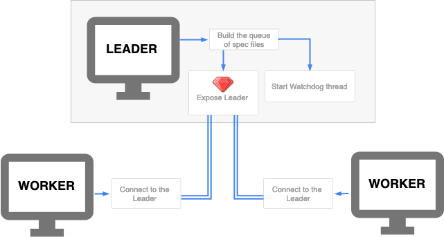
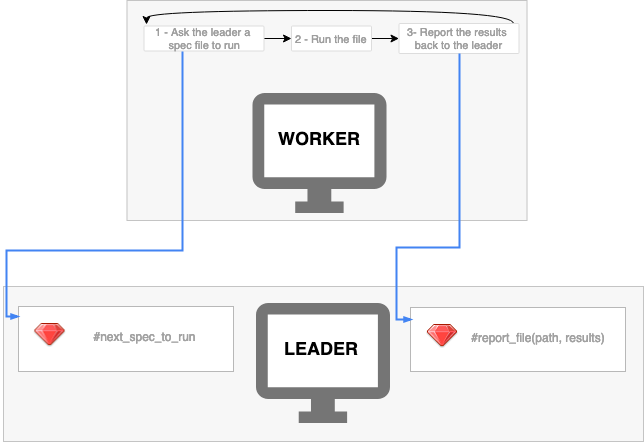

# rspec-distrib

A command-line tool to build a queue of specs and run them in parallel on
multiple machines/processes with RSpec.

## Rationale

A really large spec suite (hours) takes significantly less to execute when
spread across multiple processes.

Naive approach is to split spec files into batches, and run a process passing it
a batch of files, but due to uneven distribution spikes in total wall clock time
happen. Distrib's queue feature allows to dynamically
serve spec files one by one over the network, rather than pre-splitting them
into batches.

In the cloud the machines are either ephemeral, e.g. short-lived and can be
preempted at any moment of time, or significantly more expensive, making it
either impossible or expensive to run specs on a single machine. The goal is to
reduce total build time to minutes, and even running on a beefiest machine
doesn't help much to achieve that.

## Overview

rspec-distrib is a relatively simple client-server (Leader-Worker) wrapper on
top of RSpec, which dynamically serves spec file names to clients (workers) that
load and execute them one by one, and aggregates the results in the same format
a regular `rspec` would do.

It is possible to run rspec-distrib on a local machine, or run the Leader
locally, and Workers remotely, or run both Leader and Workers on CI, depending
on your needs. There are no tangible limitations on the number of Workers.
Workers can run side-by-side using [parallel_tests], sharing the external
services like database, Redis, Memcached, ElasticSearch, that your integration
tests might need.

The queue is fault-tolerant, e.g. when a worker machine goes down or experiences
a network partition, the spec file being executed is returned back to the queue
on timeout, and later passed to another worker.

Spec files are served from the slowest (basing on previous builds results) to
fastest to reduce worker idle time, and reduce the risk of waiting for a long
spec file to execute in the end of the build.

## Installation

Add to the Gemfile:

```ruby
gem 'distrib-core', git: 'git@github.com:toptal/distrib-core.git',
  glob: 'distrib-core/*.gemspec'
gem 'rspec-distrib', git: 'git@github.com:toptal/distrib-core.git',
  glob: 'rspec-distrib/*.gemspec'
```

## Running

There is not much difference between running on local machine, or across the
network.

```shell
$ rspec-distrib start                    | $ rspec-distrib join localhost
4386 files have been enqueued            | .................*......F..._
Using seed 27792                         |
```

You may have to prefix the command with `bundle exec`.

## Leader

The Leader purpose is to serve spec file names one by one to workers, and
aggregate the results of running those specs with RSpec.

The following command:
- builds a queue of spec files
- starts a watchdog thread (see more about watchdog in the 3nd stage)
- exposes a Leader [DRb] server on all the network interfaces

```shell
rspec-distrib start
```

You can specify seed, which will be used to randomise order of examples on workers. Or it will be generated automatically.

```shell
rspec-distrib start 12345
```



Once there are no more spec files left, the Leader drops all connections, and
reports.


## Worker

Worker connects to the Leader, receives spec file names from it, and report back
the results.

The following command runs a worker:

```shell
rspec-distrib join leader_address
```

where `leader_address` is either an IP address, or a domain name.

Worker requests spec file names from the Leader, `next_test_to_run` and reports
the execution results `report_file` back to the leader.



## Reports

Workers are sending the example reports to the Leader immediately after running
specs from that spec file. This means that if a worker dies, the Leader has kept
all the previous reports.

## Configuration

`rspec-distrib` expects to find configuration in `.rspec-distrib` file
which is loaded if it exists. Configuration is expected to be a Ruby file.

### Spec files to execute

Override default list of the spec files:

```ruby
RSpec::Distrib.configure do |config|
  config.tests_provider = -> {
    Dir.glob(['spec/**/*_spec.rb', 'engines/**/*_spec.rb'])
  }
end
```

### Handling failures on workers

There are several types of issue may occur during execution of specs on workers.

1. Expectation errors (aka legit failures of spec)
2. Failures in between of spec executions (`before`/`after` blocks)
3. Worker failed to start completely

`rspec-distrib` provides an ability to handle such errors.

#### Spec retries

`rspec-distrib` can re-run specs by certain exceptions:

```ruby
RSpec::Distrib.configure do |config|
  config.error_handler.retryable_exceptions = ['Elasticsearch::Transport::Transport::Errors::ServiceUnavailable']
  config.error_handler.retry_attempts = 2
end
```

It means that any spec which failed because of `Elasticsearch::Transport::Transport::Errors::ServiceUnavailable`
will be retried up to two times.

Leaving `retryable_exceptions` empty means ANY.

#### Handling workers which failed on start or between spec executions

`rspec-distrib` can be configured to fail leader if failures which occur in workers on startup or in `before`/`after` blocks.

```ruby
RSpec::Distrib.configure do |config|
  config.error_handler.fatal_worker_failures = ['NameError']
  config.error_handler.failed_workers_threshold = 2
end
```

It means that if worker failed with DB error outside of spec - leader will not stop and continue run anyway on other workers.

Leaving `fatal_worker_failures` empty means no error will fail leader.

#### Custom logic to handle failures

You can specify your own object to handle failures. Here is the interface for it:

```ruby
class MyErrorHandlingStrategy
  def retry_test?(file, example_groups, exception)
    # return true to retry the file
  end

  def ignore_worker_failure?(exception, context_description)
    # return true to ingore the exception
  end
end
```

And use it like this:

```ruby
RSpec::Distrib.configure do |config|
  config.error_handler = MyErrorHandlingStrategy.new
end
```

### Timeouts

Set equal timeout for all spec files to 30 seconds:

```ruby
RSpec::Distrib.configure do |config|
  config.test_timeout = 30 # seconds
end
```

Specify timeout per spec file. An object that responds to `call` and receives
the spec file path as an argument. The proc returns the timeout in seconds.

```ruby
RSpec::Distrib.configure do |config|
  config.timeout_proc = ->(spec_file) do
    10 + 2 * average_execution_in_seconds(spec_file)
  end
end
```

If both `timeout_proc` and `test_timeout` are provided, `timeout_proc`
will take precedence, unless it returns a falsey value, in which case
it will fallback to `test_timeout`.
This is useful for cases where some specs have a timeout strategy and some
don't.

### See lib/rspec/distrib/configuration.rb for the full list of options

## RSpec configuration

All RSpec configuration should be in `spec_helper.rb` or `rails_helper.rb`.
You should require `spec_helper.rb`/`rails_helper.rb` in `.rspec` file.
If you require `spec_helper.rb`/`rails_helper.rb` in spec file - configuration may not apply properly!

## FAQ

> Is it simple to use it in my project?

Yes, it's simple if you are using RSpec already. rspec-distrib is almost a
drop-in replacement. If you plan to run several Workers side-by-side on a single
machine, check [parallel_tests] documentation how to set your project up.

> How is timeout defined?

Timeout is configurable in a configuration file.
It can be configured for all of the spec files, or, if you have a
storage where you keep previous execution times per spec file, we encourage
you to use this average of a couple of last builds to calculate the timeout.
Using double the average execution time plus ten seconds is a good strategy
that prevents spec files from returning to the queue while still being executed.
It mitigates two cases:

1) spec execution time doubled

2) spec was fast (milliseconds), and then a spec file or its dependencies change
and it execution time changes, and it takes seconds.

> What happens if there's a really slow spec?

Spec file is picked up by Worker #1, times out, is returned to the queue, and is
picked up by the next worker, Worker #2. The first to submit the results wins.

> What if there's nothing left in the queue, but some spec files are being
processed?

The idle workers wait in the queue just in case there's a timed out spec file.

> Is it secure?

[DRb], the transport used, is not secure. Executing of arbitrary code on the
Leader machine is possible. Make sure no one outside of the test environment can
communicate with it.

> Who can access the Leader machine?

Anyone who has access to it over the network. Make sure it's not exposed to the
Internet.

> What is the default port?

It's port 8787, default for [DRb].

> Is it thread-safe?

Yes, thread-safe data structures are used in the implementation, and access to
non-thread-safe data structures is synchronized.

> Are the workers using the same seed the execute the specs?

Yes.

> Is it fault-tolerant?

Yes. Any number of workers can crash, the build results are not affected, but
the total build time will. Make sure to restart or spawn additional workers when
they crash.

> How the worker knows when there are no more specs to run?

The Leader drops the connection when there's nothing left, and Workers shut down
gracefully.

[DRb]: https://ruby-doc.org/stdlib-2.5.3/libdoc/drb/rdoc/DRb.html
[knapsack]: https://github.com/ArturT/knapsack
[parallel_tests]: https://github.com/grosser/parallel_tests

## Contributing

Bug reports and pull requests are welcome [on GitHub](https://github.com/toptal/distrib-core/issues).

## License

The gem is available as open source under the terms of the [MIT License](https://opensource.org/licenses/MIT).
